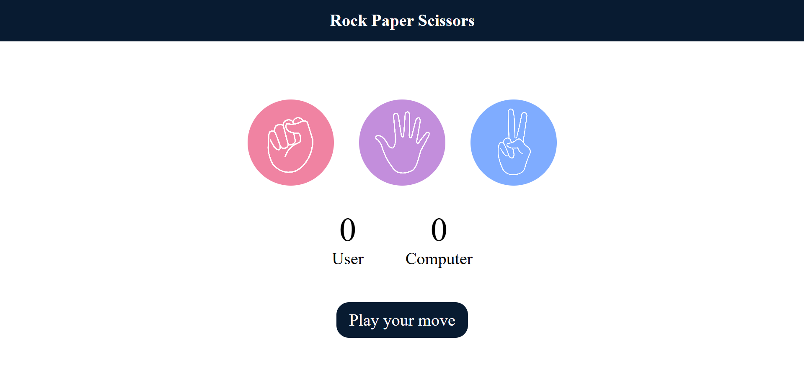

# 🎮 Rock Paper Scissors Game

A fun and simple implementation of the classic Rock Paper Scissors game, built using HTML, CSS, and JavaScript. This project allows users to play against the computer in a quick, interactive browser game. The game is now fully responsive and adapts to different screen sizes, providing a seamless experience across devices.

---

## 🌟 Live Demo

The project is live and can be played here: [Rock Paper Scissors Game](https://tonystark-19.github.io/Rock-paper-scissors/)

---

## 📸 Screenshot

---

## 📖 Table of Contents

- [Features](#features)
- [Technologies Used](#technologies-used)
- [How to Play](#how-to-play)

---

## ✨ Features

- Play against the computer.
- Fully responsive design that adapts to all screen sizes.
- Displays the result of each round: win, lose, or tie.
- Keeps track of scores for the player and computer.
- User-friendly interface and animations for a better experience.

---

## 💻 Technologies Used

- **HTML5** for structuring the content.
- **CSS3** for styling the game and ensuring responsiveness.
- **JavaScript** for handling game logic and interaction.

---

## 🎮 How to Play

1. Visit the Game [here](https://tonystark-19.github.io/Rock-paper-scissors/).
2. Choose one of the options: **Rock**, **Paper**, or **Scissors**.
3. The computer will randomly choose one as well.
4. The result of the match will be displayed:
   - **Rock beats Scissors**  
   - **Scissors beat Paper**  
   - **Paper beats Rock**
5. The score is updated after each round.
6. Play as many rounds as you'd like.
